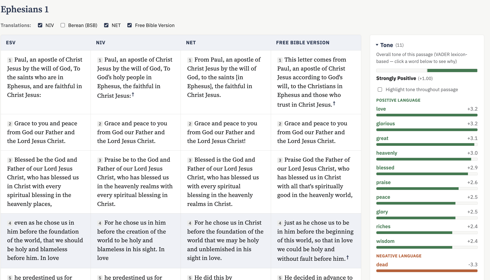

# Bible Study Tool


A local, search driven tool for close reading of Scripture. It shows up to
five translations side by side, verse aligned, with several layers of
annotation you can turn on or off:

- Direct quotations of other passages (for example, an Old Testament verse
  quoted in the New Testament) are marked inline and clickable, using
  Crossway's own ESV Study Bible citation apparatus, not a guess based on
  matching text.
- Words of Christ are shown in red.
- Discourse markers ("But", "Therefore", "For", "Behold", and similar words
  that signal how the author's argument is moving) are underlined and listed
  in a sidebar panel, grouped by category.
- A cross references panel lists related passages for whichever verse you
  click, each with a short preview and a note on whether it is a direct
  quotation or a thematic parallel.
- A tone panel gives a plain language sentiment reading of the passage
  (Positive, Negative, Mixed, and so on) using NLTK's VADER lexicon, with
  every word that drove the score listed and clickable so you can see exactly
  why. There is also a toggle to highlight all of that tone language inline.
- A top terms panel lists repeated words and phrases in the passage.
- A key terms glossary matches around 40 hand curated Hebrew and Greek
  theological terms (grace, covenant, agape, and so on) against whatever
  passage you are reading.

All the sidebar panels are collapsible, closed by default, and show a count
so you know there is something worth opening before you click.

## What you need to run it

- A Mac (or any machine with a shell), since setup uses [Homebrew](https://brew.sh/).
- [uv](https://docs.astral.sh/uv/) for running Python. If you do not have it:

  ```
  brew install uv
  ```

- Two free API keys (see below). Everything else (NLTK data, the
  cross reference and glossary data) is downloaded automatically by
  `make setup`.

## API keys you need

Secrets live in a `.env` file in the project root, which is already listed
in `.gitignore` so it is never committed. A placeholder file, `.env.example`,
shows the shape to copy.

You need two keys, one per translation service this project talks to:

1. **ESV API token**, for the ESV translation, its citation apparatus, and
   the words of Christ markup. Get one free at
   <https://api.esv.org/account/> (non-commercial use).
2. **api.bible key**, for the NIV translation. Get one free at
   <https://scripture.api.bible/>. Once you have a key, you also need the
   Bible ID for the specific NIV edition you want to use (`.env.example`
   already has the ID for NIV 2011 filled in, since that is what this
   project was built against).

Copy the example file and fill in your keys:

```
cp .env.example .env
```

```
ESV_API_TOKEN=YOUR_ESV_API_TOKEN_HERE
ESV_API_BASE=https://api.esv.org/v3

API_BIBLE_KEY=YOUR_API_BIBLE_KEY_HERE
API_BIBLE_NIV_ID=78a9f6124f344018-01
```

The server checks for all four of these on startup and tells you exactly
which are missing if you forget one.

BSB, NET, and FBV (the other three translations) come from
[bible.helloao.org](https://bible.helloao.org/), which needs no key at all.

## Setup

Once your keys are in `.env`:

```
make setup
```

This installs Python dependencies with `uv` and downloads the NLTK data the
tone and term analysis need (one time, a few seconds).

## Running it

```
make help
```

lists every command. The ones you will actually use:

- `make start`, start the server in the background and print the URL.
- `make open REF="John 3:16"`, start it if needed and open that passage
  directly in your browser. Leave off `REF` and it defaults to Ephesians 1.
- `make stop`, stop the background server.
- `make status`, check whether it is running.
- `make run`, run it in the foreground instead (Ctrl-C to stop), useful if
  you want to watch the logs.

Once it is running, open the URL it prints (normally
<http://localhost:8765>). Nothing loads until you type a reference and
search, so the app never has to fetch or hold the whole Bible at once. Type
something like `Eph 1:1-14`, `John 3:16`, or `Psalm 23` and search.

A note on scope: right now you can search a single chapter, or a verse range
within a single chapter. Multi-chapter references like `Jonah 3-4` are not
supported yet, since verse numbers reset at each chapter boundary and the
reading grid, cross references, and tone analysis all currently assume verse
numbers are unique within one request.

## How the pieces fit together

- **ESV** is fetched live from `api.esv.org` on every request and is never
  written to disk. The ESV API's terms cap local storage at 500 verses (or
  half a book), so this app keeps ESV text in an in-memory, session-only
  cache instead. The HTML passage format is used specifically to pull out
  Crossway's phrase level citation apparatus and words of Christ markup (see
  `esv_html.py`).
- **NIV** is fetched from api.bible and cached to disk, since that API's
  terms allow local caching as long as it is refreshed at least every 30
  days (see `niv.py`). Each view is reported back through api.bible's Fair
  Use Management System, as their terms require.
- **BSB, NET, FBV** are public domain or free use texts from
  bible.helloao.org, cached to disk indefinitely once fetched.
- **Tone analysis** uses NLTK's VADER lexicon rather than a larger machine
  learning model, on purpose: VADER scores individual words from an
  inspectable dictionary, so a passage's score is traceable back to specific
  words, which is what the tone panel's word lists show. A transformer model
  would likely be more contextually accurate but would give one opaque
  number with no natural way to show which words drove it, plus it would
  need a large model download this project deliberately avoids.
- **Discourse markers** come from a small hand curated bank
  (`data/discourse_markers.json`) grounded in how the ESV, as an
  "essentially literal" translation, tends to preserve markers like "Behold"
  and sentence initial "For" that more idiomatic translations smooth over.
- **The glossary** (`data/glossary.json`) is a hand curated list, not pulled
  from an API.

## Project layout

```
server.py              stdlib HTTP server and the main request handler
esv_html.py             parses ESV's HTML into text, citations, and words of Christ spans
niv.py                  fetches and caches NIV from api.bible
termanalysis.py          repeated word and phrase detection (NLTK)
discourse.py            discourse marker detection
sentiment.py            tone analysis (NLTK VADER)
booknames.py            book name and abbreviation parsing
data/                   glossary, discourse marker bank, book list, on disk cache
static/                 the frontend (plain HTML, CSS, and JavaScript, no build step)
scripts/setup_data.py    one time NLTK download, run by `make setup`
```

## Notes

- `.env` holds your API keys and is gitignored. Never commit it.
- `make clean` clears the on disk translation cache (`data/cache/`) if you
  want to force a refresh.
